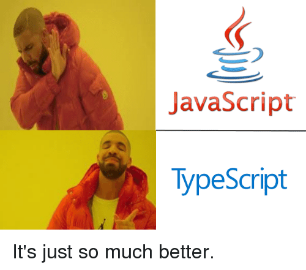

# 0x04. Typescript 

In this project, I began practicing using explicit types using TypeScript, for my specialization into backend development using Javascript + TyeScript.
## Tags: JavaScript TypeScript

## Tasks :page_with_curl:

* **0. Creating an interface for a student**
  * [task_0/js/main.ts](task_0/js/main.ts): Copy the following configuration files (provided above) into the task_0 directory: package.json, .eslintrc.js, tsconfig.json, webpack.config.js

Write your code in the main.ts file:

    Write an interface named Student that accepts the following elements: firstName(string), lastName(string), age(number), and location(string)
    Create two students, and create an array named studentsList containing the two variables
    Using Vanilla Javascript, render a table and for each elements in the array, append a new row to the table
    Each row should contain the first name of the student and the location

* **1. Let's build a Teacher interface**
  * [task_1/js/main.ts](task_1/js/main.ts): Create a directory task_1 and copy these configuration files into this folder: package.json, tsconfig.json, webpack.config.js

    firstName(string) and lastName(string). These two attributes should only be modifiable when a Teacher is first initialized
    fullTimeEmployee(boolean) this attribute should always be defined
    yearsOfExperience(number) this attribute is optional
    location(string) this attribute should always be defined
    Add the possibility to add any attribute to the Object like contract(boolean) without specifying the name of the attribute

* **2. Extending the Teacher class**
  * [task_1/js/main.ts](task_1/js/main.ts):Write an interface named Directors that extends Teacher. It requires an attribute named numberOfReports(number)

* **3. Printing teachers**
  * [task_1/js/main.ts](task_1/js/main.ts): Write a function printTeacher:

    It accepts two arguments firstName and lastName
    It returns the first letter of the firstName and the full lastName
    Example: printTeacher("John", "Doe") -> J. Doe

Write an interface for the function named printTeacherFunction.

* **4. Writing a class**
  * [task_1/js/main.ts](task_1/js/main.ts): Write a Class named StudentClass:

    The constructor accepts firstName(string) and lastName(string) arguments
    The class has a method named workOnHomework that return the string Currently working
    The class has a method named displayName. It returns the firstName of the student
    The constructor of the class should be described through an Interface
    The class should be described through an Interface

* **5. Advanced types Part 1**
      * [task_2/js/main.ts](task_2/js/main.ts): Create the DirectorInterface interface with the 3 expected methods:

    workFromHome() returning a string
    getCoffeeBreak() returning a string
    workDirectorTasks() returning a string

* **6. Creating functions specific to employees**
  * [task_2/js/main.ts](task_2/js/main.ts): Write a function isDirector:

    it accepts employee as an argument
    it will be used as a type predicate and if the employee is a director

Write a function executeWork:

    it accepts employee as an argument
    if the employee is a Director, it will call workDirectorTasks
    if the employee is a Teacher, it will call workTeacherTasks

* **7. String literal types**
        * [task_2/js/main.ts](task_2/js/main.ts): Write a String literal type named Subjects allowing a variable to have the value Math or History only. Write a function named teachClass:

        it takes todayClass as an argument
        it will return the string Teaching Math if todayClass is Math
        it will return the string Teaching History if todayClass is History

* **8. Ambient Namespaces**
  * [task_3/js/main.ts, task_3/js/interface.ts, task_3/js/crud.d.ts](./main.ts): Create a directory called task_3 and copy these configuration files into it: package.json, webpack.config.js, tsconfig.json.

    The first part of will require that you build an interface and a type. Inside a file named interface.ts:

    Create a type RowID and set it equal to number
    Create an interface RowElement that contains these 3 fields:
        firstName: string
        lastName: string
        age?: number

    You are building the next part of the application architecture. The goal is to save the entities to a database. Because of time constraints, you can’t write a connector to the database, and you decided to download a library called crud.js. Copy this file into the task_3/js directory.

* **9. Namespace & Declaration merging**
  * [task_4/package.json, task_4/tsconfig.json, task_4/js/subjects/Cpp.ts, task_4/js/subjects/Java.ts, task_4/js/subjects/React.ts, task_4/js/subjects/Subject.ts, task_4/js/subjects/Teacher.ts](./task_4): Create a new directory task_4 and copy the above tsconfig.json and put this package.json in there:
    In task_4/js/subjects:

    Create a file Teacher.ts and write a Teacher interface in a namespace named Subjects.
        the interface requires firstName and lastName as string

    Create a file Subject.ts and write a Subject class in the same namespace named Subjects.
        the class has one attribute teacher that implements the Teacher interface
        the class has one setter method setTeacher that accepts a teacher in argument (and as setter, set the instance attribute teacher with it)

    Create a file Cpp.ts and make the following modifications in the same namespace.
        Using declaration merging, add a new optional attribute experienceTeachingC (number) to the Teacher interface
        Create a class Cpp extending from Subject
        Write a method named getRequirements that will return a string Here is the list of requirements for Cpp
        Write a method named getAvailableTeacher that will return a string Available Teacher: <first name of teacher>
        If the teacher doesn’t have any experience in teaching C, then the method should return a string No available teacher

    Create a file React.ts and write a React Class in the same namespace.
        Add a new attribute experienceTeachingReact? (number) to the Teacher interface
        In the class, write a method named getRequirements that will return a string Here is the list of requirements for React
        Write a method named getAvailableTeacher that will return a string Available Teacher: <first name of teacher>
        If the teacher doesn’t have any experience in teaching React, then the method should return a string No available teacher

    Create a file Java.ts and write a Java Class in the same namespace.
        Add a new attribute experienceTeachingJava? (number) to the Teacher interface
        In the class, write a method named getRequirements that will return a string Here is the list of requirements for Java
        Write a method named getAvailableTeacher that will return a string Available Teacher: <first name of teacher>
        If the teacher doesn’t have any experience in teaching Java, then the method should return a string No available teacher

* **10. Update task_4/js/main.ts**
   * [task_4/js/main.ts](task_4/js/main.ts): 
        create and export a constant cpp for Cpp Subjects
        create and export a constant java for Java Subjects
        create and export a constant react for React Subjects
        create and export one Teacher object cTeacher with experienceTeachingC = 10
        for Cpp subject, log to the console C++, set cTeacher as the teacher, call the two methods getRequirements and getAvailableTeacher and print the strings they return
        for Java subject, log to the console Java, set cTeacher as the teacher, call the two methods getRequirements and getAvailableTeacher, and print the strings they return
        for React subject, log to the console React, set cTeacher as the teacher, call the two methods getRequirements and getAvailableTeacher, and print the strings they return

* **11. Brand convention & Nominal typing**
    *[task_5/js/main.ts, task_5/package.json, task_5/webpack.config.js, task_5/tsconfig.json]:(/task_5/js/main.ts):Create a directory task_5 and copy these configuration files into the root of task_5: package.json, tsconfig.json, webpack.config.js

    Create two interfaces MajorCredits and MinorCredits in task_5/js/main.ts:

    Each interface defines a number named credits
    Add a brand property to each interface in order to uniquely identify each of them

    Create two functions named sumMajorCredits and sumMinorCredits in task_5/js/main.ts:

    Each function takes two arguments subject1 and subject2
    sumMajorCredits returns MajorCredits value and sumMinorCredits returns MinorCredits value
    Each function sums the credits of the two subjects
